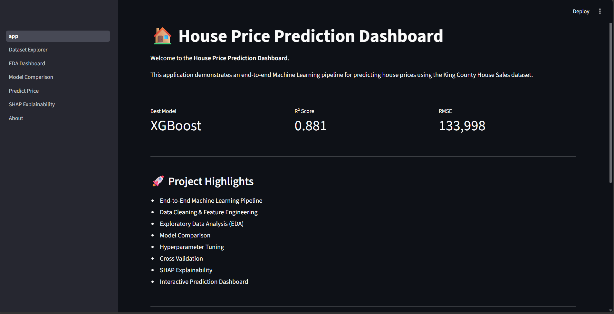
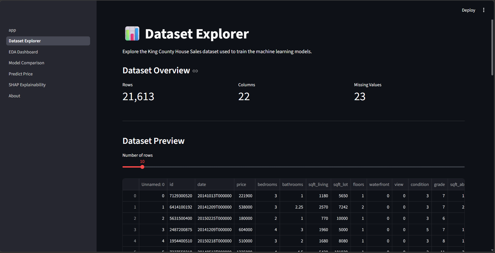
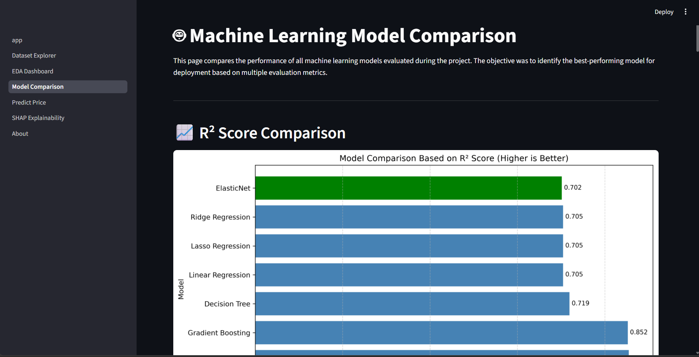
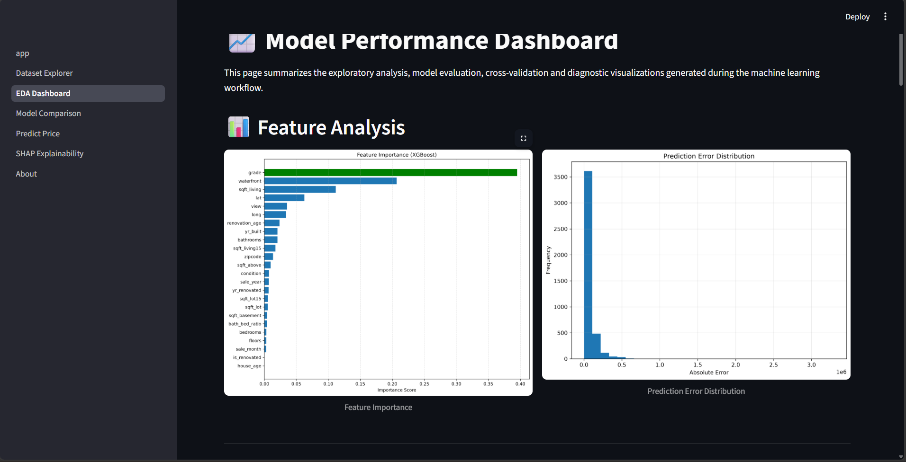
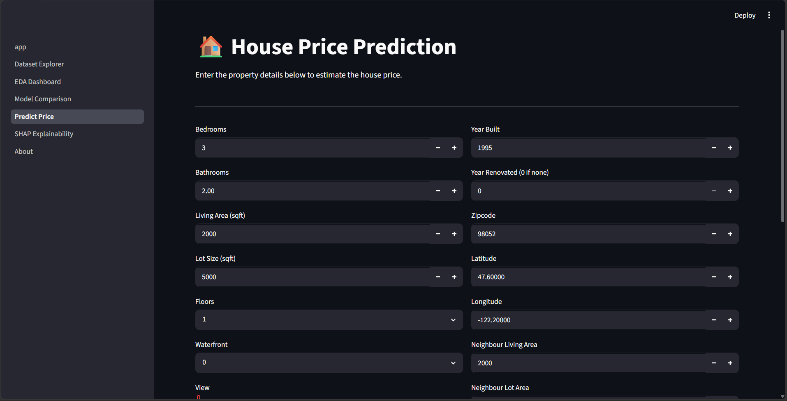
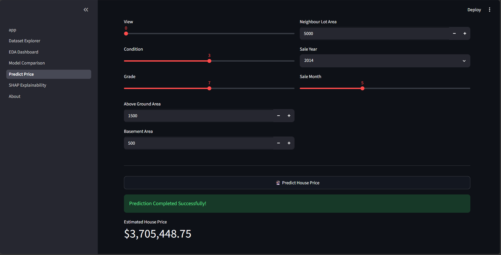
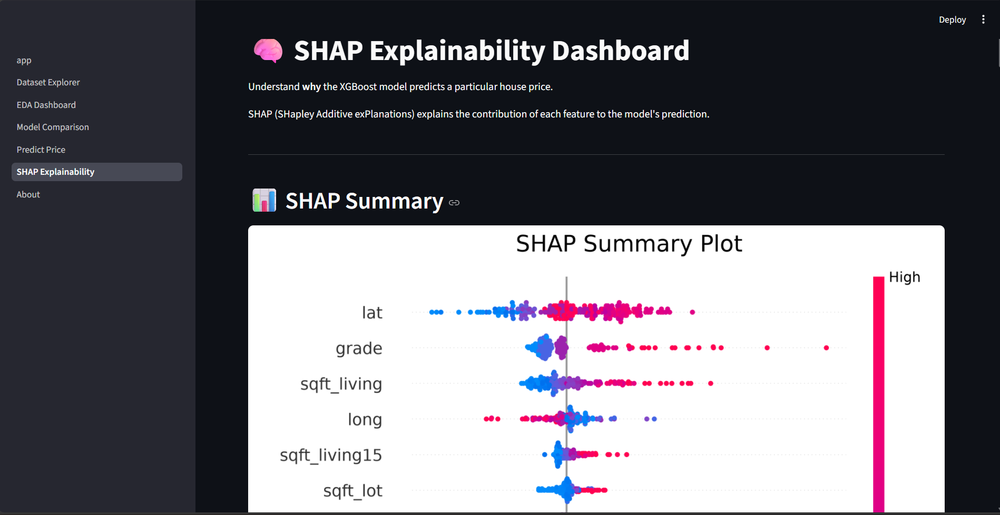
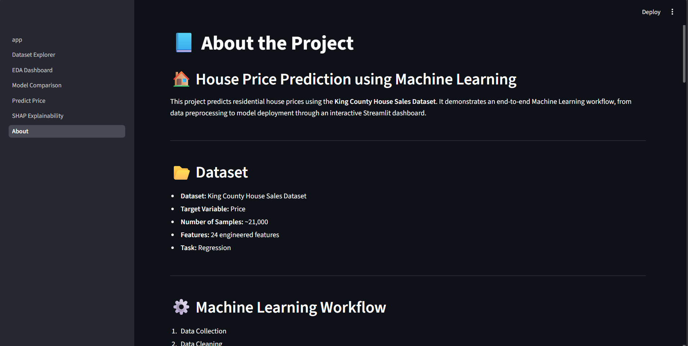

# 🏠 House Price Prediction using Machine Learning


An end-to-end Machine Learning project that predicts house prices using the **King County House Sales Dataset**. The project covers the complete ML lifecycle—from data preprocessing and feature engineering to model training, evaluation, explainability with SHAP, and deployment through an interactive Streamlit dashboard.

---

# 📌 Project Overview

This project aims to accurately predict house prices based on property characteristics such as:

- Bedrooms
- Bathrooms
- Living Area
- Lot Size
- Grade
- View
- Waterfront
- Location
- Construction Year
- Renovation Details
- and many more...

The project follows industry-standard Machine Learning practices including:

- Data Preprocessing
- Exploratory Data Analysis (EDA)
- Feature Engineering
- Model Comparison
- Hyperparameter Tuning
- Cross Validation
- Model Explainability (SHAP)
- Streamlit Deployment

---

# 🚀 Features

- ✅ Data Cleaning & Preprocessing
- ✅ Exploratory Data Analysis (EDA)
- ✅ Feature Engineering
- ✅ Multiple Regression Models
- ✅ Hyperparameter Tuning
- ✅ Cross Validation
- ✅ SHAP Explainability
- ✅ Production Model Selection
- ✅ Interactive Streamlit Dashboard

---

# 🏗️ Machine Learning Workflow

```
Raw Dataset
      │
      ▼
Data Cleaning
      │
      ▼
Feature Engineering
      │
      ▼
EDA
      │
      ▼
Train/Test Split
      │
      ▼
Model Training
      │
      ▼
Model Comparison
      │
      ▼
Hyperparameter Tuning
      │
      ▼
Cross Validation
      │
      ▼
Best Model Selection
      │
      ▼
SHAP Explainability
      │
      ▼
Streamlit Deployment
```

---

# 📊 Models Evaluated

- Linear Regression
- Ridge Regression
- Lasso Regression
- ElasticNet Regression
- Decision Tree Regressor
- Random Forest Regressor
- Gradient Boosting Regressor
- XGBoost Regressor ⭐ (Selected Production Model)

---

# 📈 Model Performance

| Metric | Value |
|---------|-------|
| Production Model | XGBoost |
| R² Score | **0.881** |
| RMSE | **133,998** |
| MAE | **67,220** |

---

# 🧠 Model Explainability

The project integrates **SHAP (SHapley Additive exPlanations)** to interpret model predictions.

SHAP visualizations include:

- SHAP Summary Plot
- SHAP Feature Importance
- SHAP Waterfall Plot
- SHAP Dependence Plot

---

# 💻 Streamlit Dashboard

The dashboard provides an interactive interface with:

- 🏠 Home Page
- 📊 Dataset Explorer
- 🤖 Model Comparison
- 📈 EDA Dashboard
- 💰 House Price Prediction
- 🧠 SHAP Explainability
- 📘 About Project

## 🏠 Home Page



---

## 📊 Dataset Explorer



---

## 🤖 Model Comparison



---

## 📈 EDA Dashboard



---

## 💰 House Price Prediction





---

## 🧠 SHAP Explainability



---

## 📘 About Project



---


# 📂 Project Structure

```text
House-Price-Prediction-ML/
│
├── app.py
├── predict.py
├── train.py
├── benchmark_models.py
├── cross_validation.py
├── generate_reports.py
├── hyperparameter_tuning.py
├── shap_analysis.py
├── requirements.txt
├── README.md
├── LICENSE
├── .gitignore
│
├── assets/
├── data/
├── models/
├── notebooks/
├── pages/
├── reports/
├── screenshots/
├── src/
└── tests/
```

---

# ⚙️ Installation

Clone the repository

```bash
git clone https://github.com/yourusername/House-Price-Prediction-ML.git
```

Navigate to the project

```bash
cd House-Price-Prediction-ML
```

Create a virtual environment

```bash
python -m venv .venv
```

Activate the virtual environment

### Windows

```bash
.venv\Scripts\activate
```

### Linux / macOS

```bash
source .venv/bin/activate
```

Install dependencies

```bash
pip install -r requirements.txt
```

Run the Streamlit application

```bash
streamlit run app.py
```

---

# 📸 Dashboard Preview

> Add screenshots after deployment.

Example:

```
screenshots/
│
├── home.png
├── dataset.png
├── model_comparison.png
├── prediction.png
├── shap.png
```

---

# 🛠️ Technologies Used

- Python
- Pandas
- NumPy
- Matplotlib
- Scikit-Learn
- XGBoost
- SHAP
- Joblib
- Streamlit

---

# 🔮 Future Improvements

- Deploy using Docker
- Add CI/CD Pipeline
- Model Monitoring
- Cloud Deployment
- REST API Integration
- Automated Retraining Pipeline

---

# 👨‍💻 Author

**Sharan G**

Computer Science Engineering Student

Machine Learning • Data Science • Python • Cloud Computing

---

# ⭐ Support

If you found this project useful, consider giving it a ⭐ on GitHub.